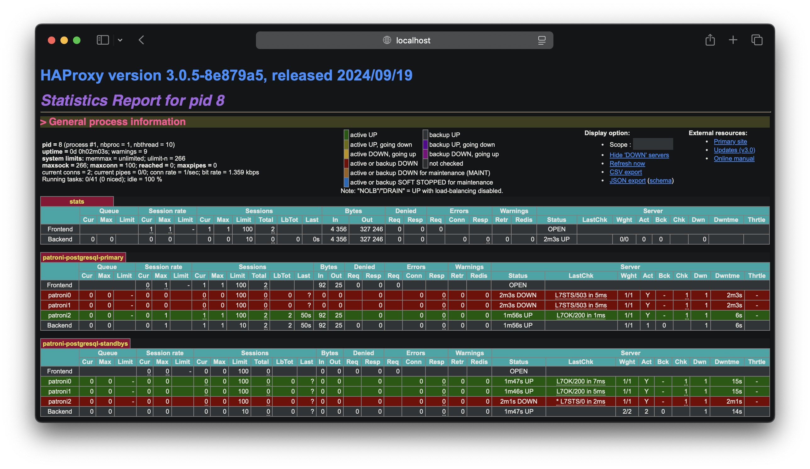

# Examples

## Docker Compose

A simple example of running a **patroni cluster** in **docker compose**.
**Do not use this example for production.**

Start example project:

```sh
docker compose up --detach
```

Test connetcion:

```sh
psql -h localhost -p 5432 -U postgres
Password for user postgres:
psql (17.0)
```

Open [localhost:8080](http://localhost:8080) and see **HAProxy Statistics Report**:


