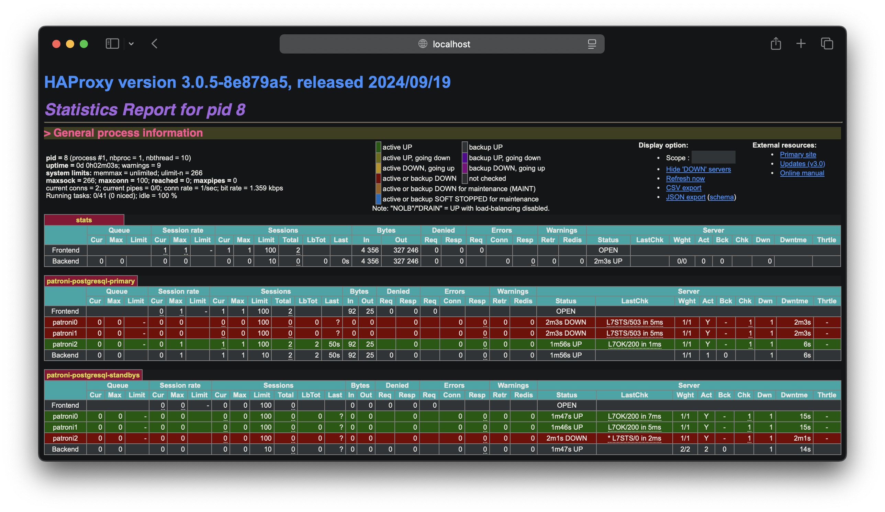

# Examples

## Docker Compose

A simple example of running a **patroni cluster** in **docker compose**.
**Do not use this example for production.**

Start example project:

```sh
docker compose up --detach --quiet-pull --wait
```
Check **etcd cluster**:

```sh
docker exec docker-etcd0-1 etcdctl endpoint status --write-out=table --cluster
```

```output
+-------------------+------------------+---------+---------+-----------+------------+-----------+------------+--------------------+--------+
|     ENDPOINT      |        ID        | VERSION | DB SIZE | IS LEADER | IS LEARNER | RAFT TERM | RAFT INDEX | RAFT APPLIED INDEX | ERRORS |
+-------------------+------------------+---------+---------+-----------+------------+-----------+------------+--------------------+--------+
| http://etcd1:2379 | 6125f400291004ec |  3.5.17 |   20 kB |     false |      false |         2 |         40 |                 40 |        |
| http://etcd2:2379 | f7c827122fd74deb |  3.5.17 |   20 kB |     false |      false |         2 |         40 |                 40 |        |
| http://etcd0:2379 | fe8d7aaaeb89e891 |  3.5.17 |   20 kB |      true |      false |         2 |         40 |                 40 |        |
+-------------------+------------------+---------+---------+-----------+------------+-----------+------------+--------------------+--------+
```

Check **patroni cluster**:

```sh
docker exec docker-patroni0-1 patronictl -c /patroni.yml list
```

```output
+ Cluster: patroni (7447582066477301782) ---------+----+-----------+
| Member       | Host       | Role    | State     | TL | Lag in MB |
+--------------+------------+---------+-----------+----+-----------+
| 22ead2f09aab | 172.18.0.6 | Replica | streaming |  1 |         0 |
| b8cd8942ee30 | 172.18.0.7 | Replica | streaming |  1 |         0 |
| ecbe69945b54 | 172.18.0.8 | Leader  | running   |  1 |           |
+--------------+------------+---------+-----------+----+-----------+
```

Test **psql** connection:

```sh
psql -h localhost -p 5432 -U postgres
Password for user postgres:
psql (17.2)
```

Open [localhost:8080](http://localhost:8080) and see **HAProxy Statistics Report**:



## Possible problems

1. fixing permissions on existing directory /var/lib/postgresql/patroni/main

Change ownership of ./patroni-data0/ to user ID 999 with superuser privileges.

```sh
sudo chown -R 999 ./patroni-data*
```

2. FATAL:  data directory "/var/lib/postgresql/patroni/main" has invalid permissions

```sh
chmod 0750 ./patroni-data*
```
